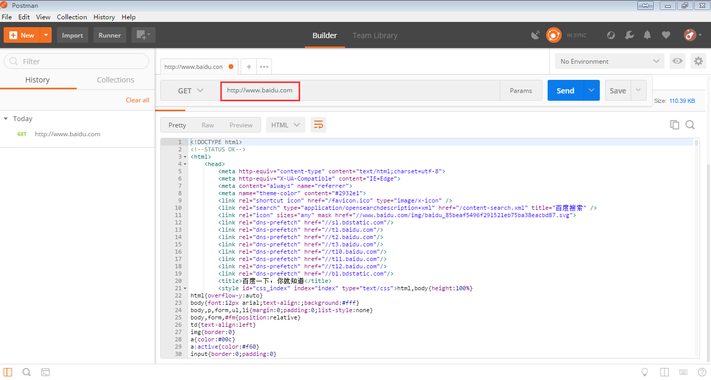
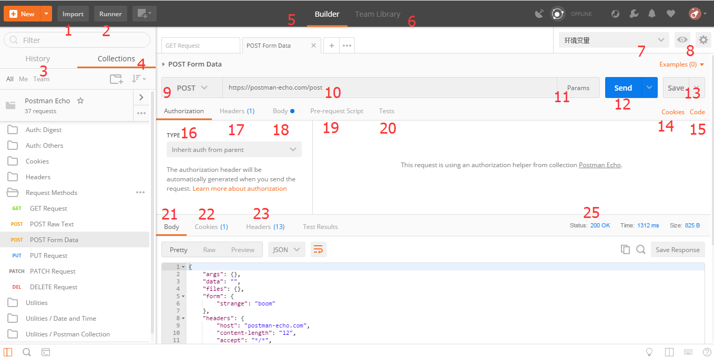

### postman-为接口测试而生

时间: 2018年01月21日

>自17年毕业，在成都*IT公司上班近半年了，之前做过一段时间web前端开发，后转做api接口对接开发了，postman是基于谷歌浏览器的API调试、Http请求的工具，以之前的测试工作也是基于这个工具的，由于项目处于开发的前期阶段，许多功能方案都不太稳定，虽说提供的api接口比较稳定，但涉及到后端api的具体实现可能有很大的变动，每次调动完可能需涉及到几十个api接口的测试，需要为一个个的接口更改依赖参数才能测试，心真累啊，近受测试组大佬陆哥的点拨，才伊始发现原来这款工具如此牛逼哄哄，果断深入学习学习，感受一下几十个api经过简单的配置更改便可以刷刷刷一键完成自动化测试的快感。

#### 1. 下载安装

- 直接去官网上下载就行了，根据自己的需求下载对应的postman版本 [postman官网下载](https://www.getpostman.com/) , 我是下载安装版的，直接运行下载的.exe进行安装(作为开发人员，我想这些简单的操作必然轻车熟路吧)，安装好后，注册一个账号，就可以使用了，当然，也可以安装基于chrome浏览器的扩展插件方式进行安装,可以参考这位同学的操作 [chrome安装postman插件](http://blog.csdn.net/water_0815/article/details/53263643) 。
- 安装好后，发送一条简单的http请求，看看低调奢华的请求界面：

<center>

</center>

浅浅的观望了一下，整体上这两版都实现了基本的测试功能模块，，app版的似乎更全、更丰富，简单的对比就是Pre-requst除了两者在写法上略有不同，还有就是app版的要多很多可操作项，能够在执行本条请求前检测其他所依赖的请求，比如有一个学生选课API接口，做功能性测试时可以通过发送http请求来先获取数据库中的某一学生ID和某一课程ID，具体提供的对比如下：

```
插件版：

//清除某一全局变量
postman.clearGlobalVariable("variable_key"); 

//清除某一环境变量
postman.clearEnvironmentVariable("variable_key"); 

//设置全局变量
postman.setGlobalVariable("variable_key", "variable_value");
 
//设置环境变量
postman.setEnvironmentVariable("variable_key", "variable_value");


app版：

//清除某一全局变量
pm.globals.unset("variable_key");     

//清除某一环境变量
pm.environment.unset("variable_key"); 

//获取全局变量
pm.globals.get("variable_key");       
 
//获取局部变量
pm.variables.get("variable_key");     
 
//获取环境变量
pm.environment.get("variable_key");   

//发送其他http请求
pm.sendRequest("https://postman-echo.com/get", function (err, response) {
	console.log(response.json());
});                                    

//设置全局变量
pm.globals.set("variable_key", "variable_value"); 
 
//设置局部变量
pm.globals.set("variable_key", "variable_value");  

//设置环境变量
pm.environment.set("variable_key", "variable_value");  
```
	
#### 2. 主界面简介

<center>

</center>


##### 功能点介绍：

```
- 1. 数据导入：可以导入测试集合，环境变量等已经存在的数据文件；
- 2. 批量执行器：可以对多条测试用例或多个测试集合进行批量测试；
- 3. 历史请求记录；
- 4. 测试用例集合，可对一个项目的测试用例按照功能模块划分，便于管理；
- 5. 单条测试用例详细操作tab；
- 6. 团队共享区域；
- 7. 选择环境变量集；
- 8. 配置、分享(付费) 多作用域的环境变量；
- 9. 包括GET、PUT、POST、DELETE、PATCH、HEAD等15种HTTP的请求方法选择；
- 10. 请求url；
- 11. 请求url参数设置；
- 12. 发送请求；
- 13. 保存/另存请求；
- 14. 历史cookie集；
- 15. 多语言转换，可以将postman请求转换为java、python等语言的请求；
- 16. Authoriation，设置请求认证；
- 17. 设置请求头；
- 18. 设置请求体；
- 19. Pre-request，发送请求前执行的脚本，可以在该模块设置环境变量，动态参数等（*）；
- 20. test测试点，对请求结果进行分析和处理(*)；
- 21. 响应体；
- 22. 请求返回的cookie信息
- 23.响应头；
- 24. test测试结果(忘写编码了，就编号23旁边)；
- 25.响应状态码。
```

这一篇博文先简单记录到这吧，下一篇详细整理一下环境变量设置和如何复用度较高的测试用例集。