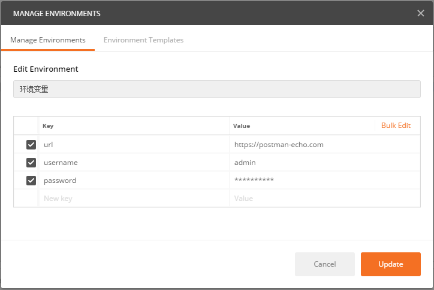
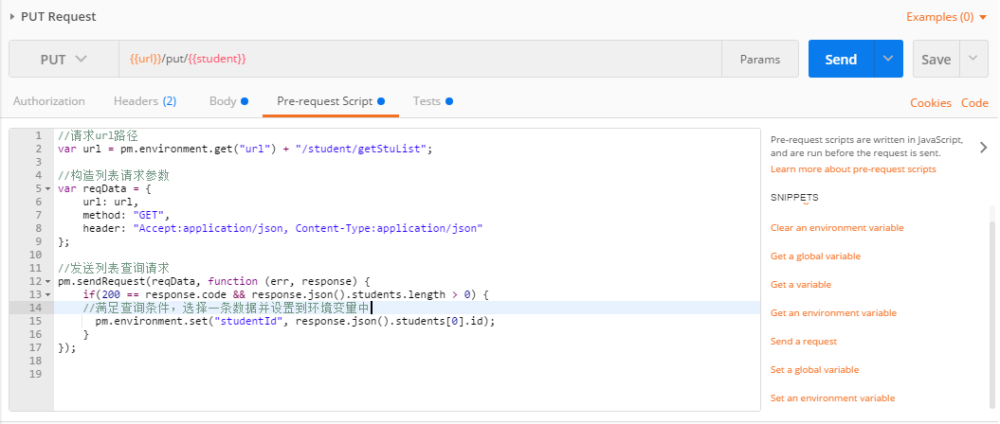
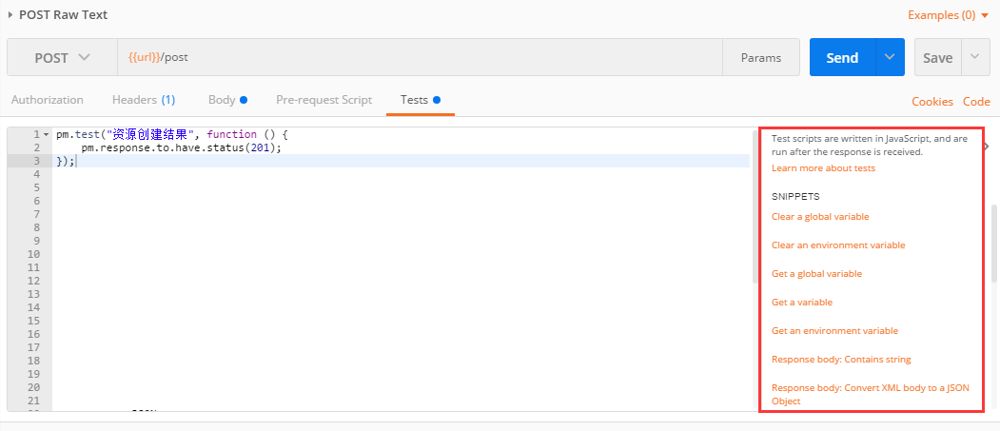
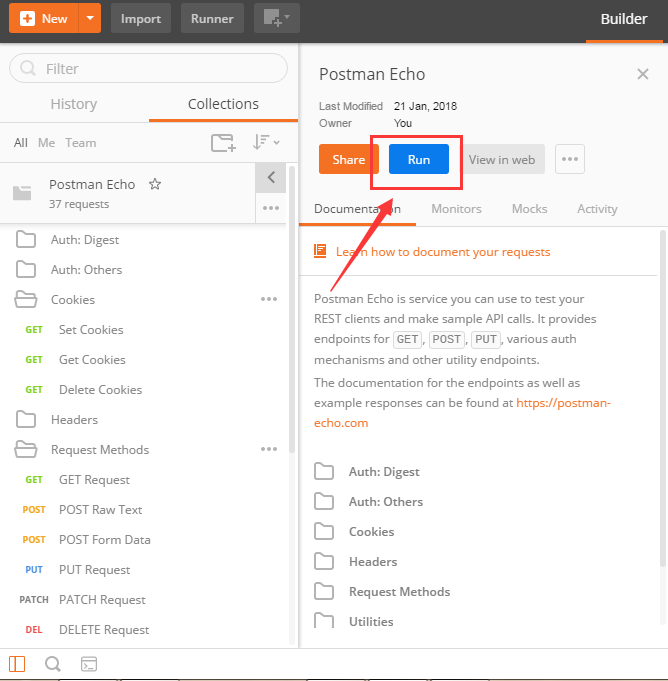
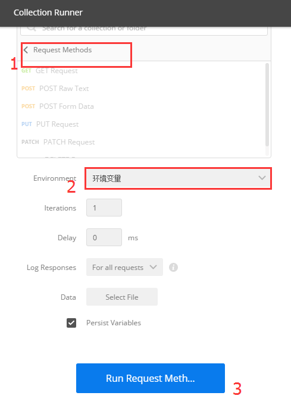
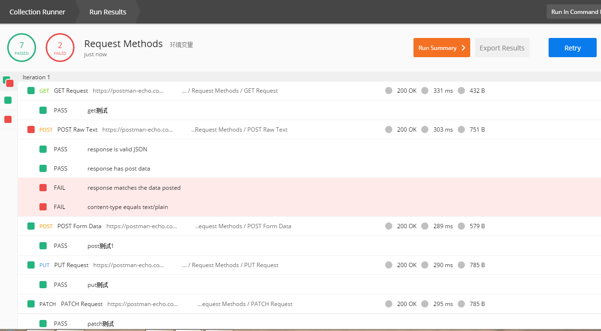

### postman接口测试操作

时间: 2018年01月28日

> 其实和部分其他同事一样，使用postman在做接口测试时候，需要对每个测试的接口都要进行一些参数配置，这些参数配置是相互独立的，即使相同的参数项，都要进行分别配置，我想，作为接口开发人员，可能不太把关注点放在接口测试的效率上，但每次开发时进行功能迭代或者模块修改后的测试工作可能得花上个把小时才能把自己负责的接口依次轮一遍，这还不包括处理接口出现错误的时间，so，开发自测还是相当重要的。

#### 1. 环境变量

- postman根据变量作用域的不同可分为全局变量(global variable)、环境变量(environment variable)、局部变量(local variable)。故名思议，很简单，在postman这个测试环境中，全局变量表示一旦设定一个变量为全局的，那么，所有的测试项目都可以使用这个变量；环境变量在测试尤其是在批量测试时，必须要进行选择，我觉得一个测试项目对应一个环境变量配置集合，一般可以把根URL这类型的东西放在环境变量里，设置全局变量或局部变量可以提高变量的公用性，各个测试项目的环境变量应分开以避免混淆；局部变量在请求的预处理pre-request和请求结果处理test里面用得较多。

#### 2. Pre-request

- 前文有讲，Pre-request能够在进行正式的http请求之前进行一些预处理操作，postman的这个特性大有益处，比如设置环境变量、检测数据的有效性等，在我实际开发的自测过程中，遇到的问题是，项目多个人员一起开发测试的时候，大家经常会去手动清空redis里面缓存的用户认证token信息，token失效便自然需要重新获取有效的token值了，那么Pre-request的作用就体现出来了，我们可以在这个脚本里面自动验证token是否过期，如果过期，则获取一个新的token值；还有就是比如你想要自动化的修改某一条数据的属性，要自动化的完成，那这条数据对应的ID号就必须自动获取，其实也比较简单，就是在发送这条PUT请求之前可以先查询该数据列表，然后从其中选择一条有效数据的ID并提前设置到环境变量中，那么在真正发送url请求的时候这个ID值就可以从刚设置的环境变量中获取咧，Pre-request是支持原生js的，要玩这个你得会点简单的js，当然作为开发人员你即使不会也分分钟能上手（^^），配合js，Pre-request脚本里基本基本的CURD操作都能够很好的处理，下面以生成一个studentId为例，先查询出有效的studentId，然后将其设置到环境变量中studentId中，如下：

#### 3. Test

- Test脚本可以对请求的结果进行处理，相比于Pre-request的Snippets就丰富多了，包括如检查状态码、检查响应串、验证JSON、检查header、限制应答时间等，最常用的就是判断CURD的结果的状态码是否和预定义的一致，比如创建成功使用CREATED(201)、查询修改成功OK(200)、删除成功可用NO-CONTENT(204)等,可以从右侧快捷菜单栏中选择预存的一些常用方法快速生成相应的Test结果功能测试点：

#### 4. Collection Runner
 
- 当接口需要迭代测试时，Collection Runner批量运行功能就发挥了巨大作用，可以简单的选择需要运行的请求集合，点击Run，然后便可以对这个集合里面的接口进行测试了，Runner测试的最小单位可以是Folder，即Collection测试集合里最小的一个模块测试文件夹，再选择你所配置的环境变量，仅这两步，然后点击Run按钮后就可以进行批量测试了。

- Runner测试结果的展示也非常的友好和直观，除了对测试集合的测试功能点的成功和失败格式进行统计，还详细展示了批量请求的各成功和失败的case，这样我们就能聚焦处理fail的case而可以不过于关注成功的case了。

- 小伙伴们，postman赶快用起来！！！